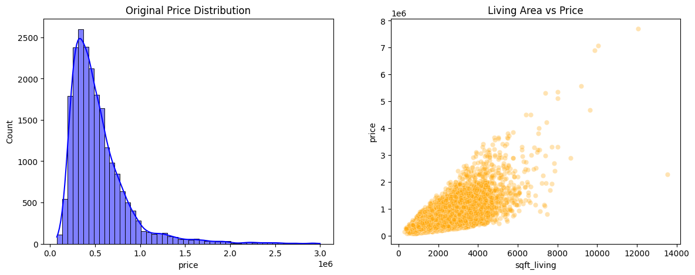
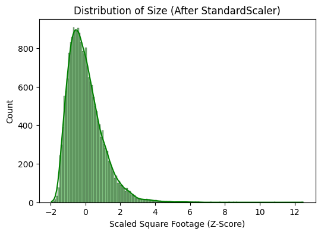
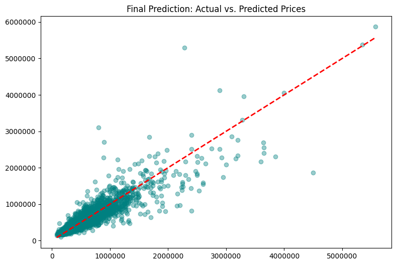

# Advanced Regression: House Price Prediction

## 📌 Project Overview
This project focuses on building a robust regression model to predict house prices using the King County housing dataset. It showcases a complete end-to-end machine learning workflow, including Exploratory Data Analysis (EDA), feature scaling, and training a Gradient Boosting Regressor for highly accurate continuous value predictions.

## 📊 Dataset Details
* **Source:** King County House Sales (`kc_house_data.csv`)
* **Predictive Features:** Bedrooms, Bathrooms, Sqft Living, Latitude, Longitude.
* **Target Variable:** House Price (Continuous).

## 🛠️ Tech Stack
* **Language:** Python
* **Data Processing:** Pandas, Scikit-Learn (`StandardScaler`)
* **Machine Learning:** Scikit-Learn (`GradientBoostingRegressor`)
* **Visualization:** Matplotlib, Seaborn

## 🔬 Methodology & Visualizations

### 1. Exploratory Data Analysis (EDA)
Conducted initial trend analysis to understand the frequency distribution of house prices and their structural relationship with the living area size.
 

### 2. Feature Engineering & Scaling
Isolated key structural and geographical features. Applied `StandardScaler` to normalize the data, ensuring the machine learning model processes all features on a standardized scale (Z-score normalization).
 

### 3. Model Training
Partitioned the dataset using an 80/20 Train-Test split. Trained a `GradientBoostingRegressor` with optimized hyperparameters (`n_estimators=200`, `learning_rate=0.1`, `max_depth=5`) to map complex data patterns.

### 4. Evaluation & Forecasting
Evaluated the model's predictive power using Mean Absolute Error (MAE) and Root Mean Squared Error (RMSE). Plotted the actual vs. predicted prices to visually inspect the model's variance and accuracy.
 

## 💡 Key Insights
* The Gradient Boosting Regressor effectively captures complex, non-linear relationships between geographical coordinates (lat/long), house size, and the final price.
* Feature scaling successfully stabilized the distribution of square footage, ensuring proportional feature weighting during training.
* The actual vs. predicted scatter plot demonstrates a strong positive correlation, indicating high predictive reliability across the majority of the housing market spectrum.

## 👨‍💻 Author
**Subhan Ali**
* **Email:** subhan034749@gmail.com
